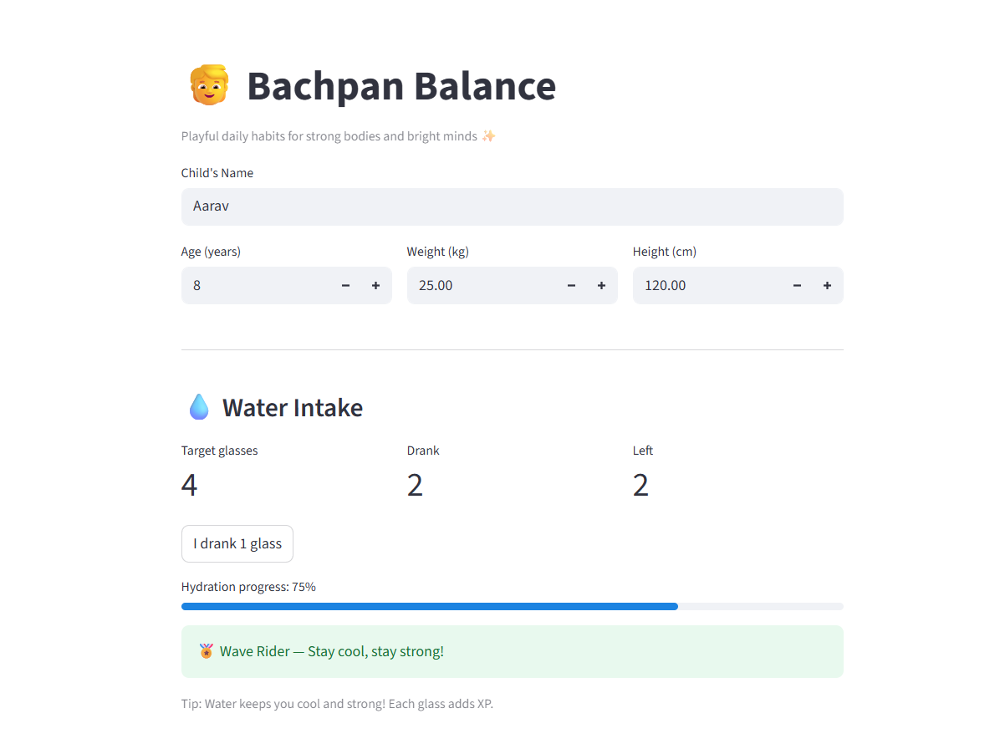

# 🌟 Bachpan_Balance

A fun and inspiring app for kids to build healthy daily habits – water intake, eating fruits, school work, play, and more. 🎉  
Encourages children through badges, stars, and positive messages.  

## 🚀 Live Demo
👉 Try it here: [Bachpan_Balance App](https://uckeynygu5fngy8crmjnho.streamlit.app/)


## 🏅 Badges


## 📸 Screenshots

### Home Page


## ✨ Features
- 🧒 Add child’s name, age, weight, and height
- 💧 Track daily water intake with fun badges
- 🍎 Record fruit intake + health benefits
- 🥚 Track protein foods (veg & non-veg)
- 📚 School Work & Exam Prep reminders
- ⚽ Indoor & Outdoor play appreciation
- 📱 Healthy screen time reminders

## ⚙️ How to Run Locally

1. Clone the repo  
   ```bash
   git clone https://github.com/IshratAiJournal/Bachpan-Balance.git
